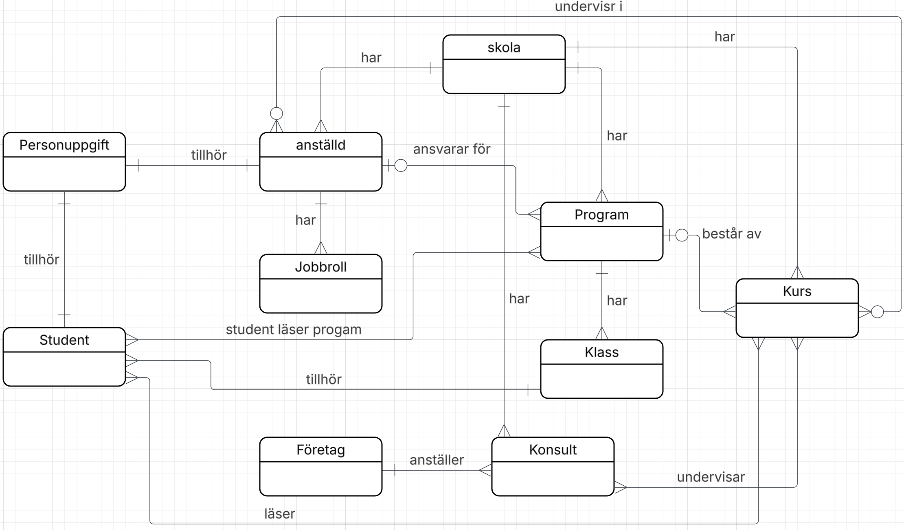
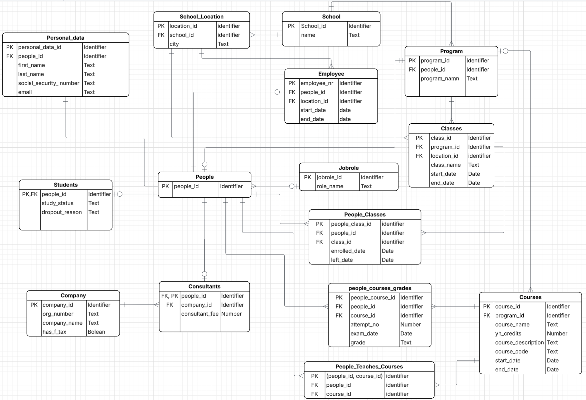

# YrkesCo – Data Modelling Project

A relational database modelling project for a fictional Swedish vocational
education provider, developed from business requirements through conceptual,
logical and physical data modelling to a working PostgreSQL implementation.

The project replaces fragmented spreadsheet-based information management
with a structured relational database for students, employees, consultants,
programs, courses, classes and school locations.

## Business Problem

YrkesCo manages information across multiple spreadsheets and learning
platforms. Data about students, educators, education managers, consultants,
courses and programs can therefore become fragmented and difficult to manage
consistently.

The goal of this project was to design a scalable relational database that
centralizes this information while maintaining clear relationships,
data integrity and separation of sensitive personal information.

## Data Modelling Process

The database was developed in three modelling stages.

### Conceptual Model

The conceptual model describes the main business entities and how they
interact at a high level.

The model includes areas such as:

- Students
- Employees
- Consultants
- Companies
- Programs
- Courses
- Classes
- Schools and locations
- Personal information



### Logical Model

The conceptual model was translated into a logical relational model with
attributes, primary keys and explicit relationships.

A central design decision was to model `people` as the common identity for
individuals in the system while separating personal information from
operational data.

This allows sensitive information to be managed independently from the
business entities that use it.

The model also introduces bridge tables where many-to-many relationships
need to be represented.



### Physical Model

The logical model was implemented as a PostgreSQL schema.

The physical design includes:

- Primary and foreign keys
- UUID identifiers
- NOT NULL constraints
- UNIQUE constraints
- CHECK constraints
- Referential integrity
- Bridge tables for many-to-many relationships

The DDL implementation can be found here:

`yh_labb/physical_DDL/ddl_schema.sql`

## Business Rules

The database models several rules from the YrkesCo business requirements.

Examples include:

- Students belong to classes connected to educational programs.
- Programs consist of multiple courses.
- A program can have multiple classes representing different cohorts.
- Educators can be permanent employees or external consultants.
- Consultants belong to external companies.
- Courses can belong to programs or be offered independently.
- YrkesCo can operate across multiple locations.
- Sensitive personal information is stored separately from operational data.

Additional requirements were also introduced to strengthen the model,
including support for multiple exam attempts and requiring a reason when
a student leaves a program.

## Data Integrity

Database constraints are used to enforce important business rules directly
in PostgreSQL.

Examples tested in the project include:

- YH credits must be greater than zero.
- Consultant fees must be greater than zero.
- Company organization numbers must follow the expected format.
- Relationships between entities must reference valid records.

Constraint behaviour is tested in:

`yh_labb/sql/constraint_tests.sql`

## Sample Data

Sample data is provided to populate the database and verify that the model
works as intended.

The insertion order follows table dependencies:

1. Independent/base tables
2. People and roles
3. Educational structure
4. Dependent entities
5. Bridge tables

Sample data can be found in:

`yh_labb/sql/insert_sample_data.sql`

## Query Verification

The database implementation is validated using SQL joins that answer
business-oriented questions.

Examples include:

- Which education manager is responsible for a program?
- How are grades distributed for a specific course?
- Which consultants teach which courses?
- Which companies do external consultants represent?

The verification queries can be found in:

`yh_labb/sql/join_verification.sql`

## Tech Stack

- PostgreSQL
- SQL
- Docker
- Docker Compose
- Relational Data Modelling
- Git / GitHub

## Repository Structure

```text
data_modelling/
├── README.md
├── docs/
│   └── YrkesCo.pdf
│
└── yh_labb/
    ├── conceptuell/
    │   └── conceptual_model_YrkesCo.png
    │
    ├── logical/
    │   └── logical_model_YrkesCo.png
    │
    ├── physical_DDL/
    │   └── ddl_schema.sql
    │
    ├── sql/
    │   ├── constraint_tests.sql
    │   ├── insert_sample_data.sql
    │   └── join_verification.sql
    │
    └── docker/
        └── docker-compose.yml
